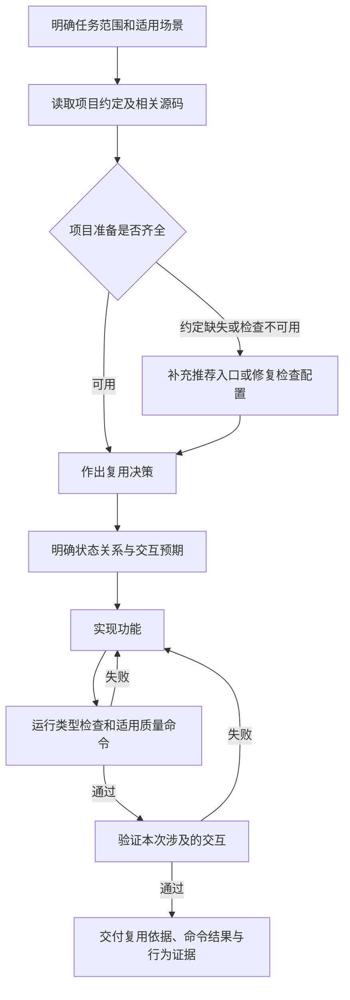

# 项目约定与复用验收流程设计

状态：流程已纳入 npm 的基础规则、通用技能、admin 场景和使用说明。业务项目的 profile 创建、类型配置修复和页面交互验收须在对应项目任务中执行，本稿不表示这些工作已完成。

目标：让 AI 在写页面前找到本项目推荐能力，对复用选择给出可核对的依据，并用类型检查和真实交互结果证明交付范围。后台专属要求留在 admin，通用 Vue 和 H5 继续使用各自适用的规则。

**一、分成项目准备与每次开发两个周期。**

项目首次接入、组件体系变化或检查配置失效时，维护 `.ai-code/profile.md` 并建立可运行的类型检查。每次任务读取当前约定和源码，选择复用方式，实现后验证本次涉及的交互。常规决策直接推进，不需要逐步审批，也不要求每次新增流程文档。



图中准备阶段发现的历史问题，先判断与当前任务的依赖关系。不受影响的设计和实现可以继续；未修通的检查必须在交付中保留失败或未运行状态，不能宣称完整验收通过。每次修改后的复查按影响范围执行，无新问题时不重复扩大测试。

| 规则归属 | 本流程负责的内容 |
| --- | --- |
| 通用 Vue | 项目入口发现、复用依据、数据流和类型边界、异步与状态验证、如实报告检查结果。 |
| admin | 推荐搜索与表格能力、后台配置组织，以及本次涉及的搜索、重置、标签切换、启停和统计一致性。 |
| mobile-h5 | 选用移动端能力，补充实际涉及的触摸、软键盘、安全区、滚动和弱网验证。 |
| 项目 profile | 本仓库的具体路径、推荐用途与局部例外；不把一家项目的组件名写成所有项目的规范。 |

**二、项目约定：记录推荐入口和使用范围。**

`.ai-code/profile.md` 由项目维护，npm 提供写法指导；现有 `init` 和 `sync` 保持不创建、不覆盖该文件。首次整理时先检查源码，再写入有依据的入口；约定缺失不等于禁止开发，可以先依据同场景实现工作并明确待补内容。

包内 `content/templates/` 提供通用 Vue、admin、mobile-h5 三份独立模板，包含填写说明、待填表格和示例。项目选择一份复制为 profile，替换占位内容并删除不适用部分；混合项目按模块范围合并章节。模板是手动选取的起点，不自动作为项目事实或额外场景规则加载。

每个推荐项只记录四件事：适用场景、解决什么问题、源码入口、参考实现及其可借鉴部分。组件 Props（输入属性）、事件参数和接口字段继续以源码为准，不在 profile 中维护第二份契约；质量命令保留在 `package.json` 和现有配置映射中。

以当前 front-aggregate 为例，已核实以下入口，可作为后续 profile 的起点：

| 适用范围与能力 | 源码或参考入口 | 推荐用途 |
| --- | --- | --- |
| admin 搜索 | [NewSearchForm](/Users/edy/code/front-aggregate/src/components/NewSearchForm/index.vue) | 评估文本、单选、选项、提交和重置能力；不能省略实际契约核对。 |
| admin 表格 | [NewTable](/Users/edy/code/front-aggregate/src/components/NewTable/index.vue) | 仅用于需要表格展示的功能；头像网格不因此改成表格。 |
| 本仓库调用范例 | [订单页面](/Users/edy/code/front-aggregate/src/views/orders/index/index.vue:7) | 参考搜索与表格的接入方式；不将整页视为质量标准或无条件复制。 |
| 团队认可的外部组织范例 | [账号池页面](/Users/edy/code/matrixflow-front/src/views/accountPool/tiktok/index.vue:37) | 学习配置、私有组件和业务编排的分工；导入路径、Hook 和业务字段必须在当前项目重新核实。 |

实际 profile 内使用相对项目根目录的稳定路径，并按场景分段。混合项目写清对应模块；当前未核实 H5 推荐入口时不填入后台页面作为替代。

完成条件：推荐路径实际存在，适用范围清楚，说明了参考哪一部分；没有把源码事实、质量命令或未确认的组件能力复制成新的长期维护清单。

**三、复用决策：需求、源码能力和缺口一一对应。**

每次任务只核对与当前需求相关的能力。读取候选组件或 Hook（组合式函数）的源码，并至少查看一个已有调用方，避免只凭名称或目录决定。

| 判断 | 采用方式 | 要留下的依据 |
| --- | --- | --- |
| 当前输入、事件、布局和状态能力满足需求 | 直接复用，通过配置或插槽接入 | 源码入口、调用范例、使用的能力。 |
| 核心交互匹配，缺口可以兼容补充 | 评估最小扩展或页面适配 | 缺少的能力、拟调整位置、已有调用方的影响范围。 |
| 交互模型不匹配，或扩展会牵连无关调用方 | 就近实现页面私有组件或逻辑 | 不匹配的需求、对应源码证据、不能合理扩展的原因。 |

不复用说明采用一段短记录即可：

```text
需求：当前功能必须具备的交互或约束。
候选：组件或 Hook 的实际源码位置，以及已有调用方。
现有能力与缺口：哪些已满足，哪些未暴露或语义不同。
扩展评估：配置、插槽、小范围适配是否足够，会影响哪些调用方。
决定：直接复用、兼容扩展或私有实现，以及对应验证项。
```

例如头像库需要一个文本输入、两个单选及搜索/重置。现有 NewSearchForm 已有这些基本能力，应先核对布局、回车和输入限制等差异，再确定接入方式。“更贴近设计稿”“直接写更简单”不能独立证明能力不匹配。

当前组件某项功能未暴露时，需要指出相关属性、分支或事件的核对结果；不能把“没有看到示例调用”当成“组件不支持”。复用决定记录在当前任务说明或代码审查说明中，不要求另建日志文件。

完成条件：所有新建的相似能力都能解释为什么不使用已有实现；说明可以回到源码核对，且没有强行复用不适合当前场景的组件。

**四、类型检查：先让检查可用，再把它接进交付。**

本次已知现状：front-aggregate 的 `scripts.typecheck` 映射为 `null`；此前全项目检查报 TS6305。当前应用配置引用了 `tsconfig.node.json`，而 Node 配置启用 `composite` 并同时纳入应用源码，需要优先梳理应用与构建脚本的检查边界。

后续落地按以下顺序执行：

1. 复现现有类型检查错误，区分检查配置问题、历史类型错误和本次新增错误。
2. 核对应用、构建脚本、全局声明和生成类型的归属，修正配置边界；保留应检查的 Vue、TS、TSX 文件。不能通过排除业务目录、添加 `any` 或忽略错误来制造通过。
3. 在 `package.json` 中增加独立的 `typecheck` 命令，参数以修正后的应用检查配置为准。保留类型检查与构建各自可观察的结果，不只依赖串联的 `build:ts`。
4. 显式把 `.ai-code/config.json` 中的 `scripts.typecheck` 映射到该脚本。当前 `sync` 保留已有脚本映射，不会重新识别新增命令；本设计不假设它已经具备这一能力。
5. 执行独立类型检查，再确认 `ai:check` 实际调用了它。配置修复时可在临时副本中放入一个已知的 Vue 类型错误，验证能被检查发现；移除后恢复正常结果。

历史问题未解决时，报告“类型检查失败，具体原因……”；其余独立工作仍可推进。观察模式允许缺失项不阻断命令，不意味着该项通过。项目决定启用阻断模式时，沿用既有 `enforce` 配置，不因后台或 H5 场景自动切换。

完成条件：命令覆盖预期应用文件并正常执行，已处理的范围有清楚结果；ESLint（代码规则检查）、类型检查、构建分别报告。仅 Vite 构建成功不足以证明类型正确。

**五、交互验收：实现前写清预期，实现后验证结果。**

以下是头像库后台页的验收示例，按本次改动选择适用项，不作为每个 Vue 或 H5 页面的固定清单。具体默认值、接口结果和统计口径须来自已确认需求。

| 行为 | 操作与异常场景 | 应观察的结果 |
| --- | --- | --- |
| 搜索 | 修改关键词、排序或格式，再提交；有异步查询时模拟旧请求晚返回 | 结果对应已提交的条件；旧响应不能覆盖新结果。 |
| 重置 | 先修改多个条件并切到非默认标签，再点击重置 | 输入、已提交条件、标签和列表回到一致的默认状态；再次进入不继承污染的默认值。 |
| 标签切换 | 保留尚未提交的关键词，再切换启用/停用标签 | 按预先声明的策略执行。建议仅改变已提交的状态条件，未提交输入不随之生效；若产品约定联动提交，应明确并验证。 |
| 启停 | 连续点击同一项，操作其他项，并模拟成功与失败 | 同一项避免重复提交；其他项按约定可操作；成功后相关展示一致，失败保留原值或按策略回滚。 |
| 图片失败 | URL 为空、返回 404，再切换成可用 URL | 显示明确占位，卡片尺寸稳定；资源恢复后正常展示。 |
| 空态与统计 | 无匹配结果、全部停用、操作失败 | 空态合理；列表、标签计数和统计依据同一已确认口径，不自行编造库存公式。 |

搜索、重置、标签切换等关键状态组合优先使用项目已有测试设施；图片失败、主题和布局等需要在浏览器中检查。没有测试框架时，先执行可复现的人工验收并记录操作与结果，不为一页自动引入新框架。

接口未提供时，可以用受控模拟响应验证组件行为和失败恢复，但结果标记为“模拟验证”；真实接口持久化和联调仍为待验证。仅在内存中切换状态，不能证明保存成功。

完成条件：每个适用项都对应可复现操作与实际观察，标明自动测试、浏览器验证或模拟验证；未运行和不适用分别说明，不将代码中存在处理分支等同于行为已验证。

**六、交付结果与后续修改位置。**

一次任务最终只需给出三类证据：采用了哪些能力及不复用的具体理由；实际运行的命令和结果；本次交互的验证方式、观察结果与未验证项。日常任务不要求新增三份报告。

| 落点 | 后续职责 |
| --- | --- |
| 业务项目 `.ai-code/profile.md` | 维护具体推荐入口、用途与场景范围；项目级长期资产。 |
| 通用规则、组件与 Hook 技能 | 保留通用复用方法、类型边界与证据要求，不写入后台组件名。 |
| admin 技能 | 承接后台搜索/列表的复用判断与对应交互验收示例。 |
| mobile-h5 技能 | 保留移动端环境的验收要求，按具体页面选择。 |
| 业务项目类型配置与脚本映射 | 修通项目检查链路；npm 包继续调用项目脚本，不统一覆盖各项目 TypeScript 配置。 |
| 当前任务说明或代码审查说明 | 保存本次复用决策、命令结果和交互证据。 |

建议先在头像库任务完成一次完整试行，再用一个纯 Vue 页面和一个 H5 页面验证范围隔离；检查两者能保留通用能力，同时没有被要求创建后台配置目录或接入后台组件。没有实际运行的模型生成对照继续标为“未运行”。
